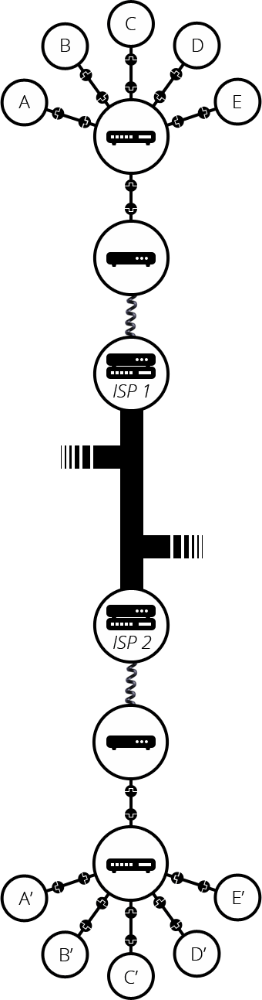

- 인터넷이란?
- 단순한 네트워크
- 네트워크 속의 네트워크

---

## 인터넷이란?

웹의 핵심적인 기술, 컴퓨터들이 서로 통신 가능한 거대한 네트워크  
TCP/IP 프로토콜을 기반으로 전 세계 수많은 컴퓨터와 네트워크들이 연결된 광범위한 컴퓨터 통신망

---

## 단순한 네트워크

두 대의 컴퓨터가 통신이 필요할 때, 각각의 컴퓨터는 물리적 또는 무선으로 연결되어야 한다.  
두 대의 컴퓨터를 연결한다고 가정했을 때, 아래와 같은 모양일 것이다.

같은 방식으로 원하는 만큼의 컴퓨터를 연결할 수도 있다.  
그러나 이렇게 연결할 수록 매우 복잡해진다.

이러한 문제를 해결하기 위해 **라우터**가 등장한다.  
라우터는 간단히 말해 경로를 설정해주는 역할을 한다.  
복잡했던 연결이 라우터를 사용하니 이렇게 간단해지는 것을 볼 수 있다.

---

## 네트워크 속의 네트워크

그렇다면 더욱더 나아가 수백, 수천, 수십억 대의 컴퓨터를 연결하려면 어떻게 해야할까?  
컴퓨터를 라우터에 연결하고, 라우터와 라우터를 연결하면 된다.

우리는 이러한 방식으로  무한히 확장할 수도 있다.

이러한 네트워크는 우리가 인터넷이라고 부르는 것과 유사하다.  
하지만 케이블을 연결할 수 없는 지역과 지역 사이, 아주 먼 곳 사이의 통신은 어떻게 처리해야 할까?  
우리는 이미 모든 집집마다 연결된 케이블이 있다. 바로 '전화선'이다.  
우리의 네트워크와 전화 시설을 연결하기 위해선, **모뎀**이라는 특수 장비가 필요하다.  
모뎀은 우리 네트워크의 정보를 전화 시설에 처리할 수 있는 정보로 바꾸며, 그 반대의 경우도 마찬가지다.

모뎀을 통해 우리의 네트워크는 전화 시설에 연결된다.  
하지만, 아직까지 우리의 컴퓨터가 보낸 메시지가 도달해야 할 컴퓨터까지 도달하지 않은 상태이다.  
이 메시지가 전달되려면 **인터넷 서비스 제공 업체(ISP)**에 연결되어야 한다.  
ISP는 모두 함께 연결되는 몇몇 특수한 라우터를 관리하고 다른 ISP의 라우터에도 액세스할 수 있는 회사이다.

따라서 우리 네트워크의 메시지는 ISP 네트워크의 네트워크를 통해 대상 네트워크로 전달된다.  
인터넷은 이러한 전체 네트워크 인프라로 구성된다.

---

#### References

https://developer.mozilla.org/ko/docs/Learn/Common_questions/How_does_the_Internet_work
