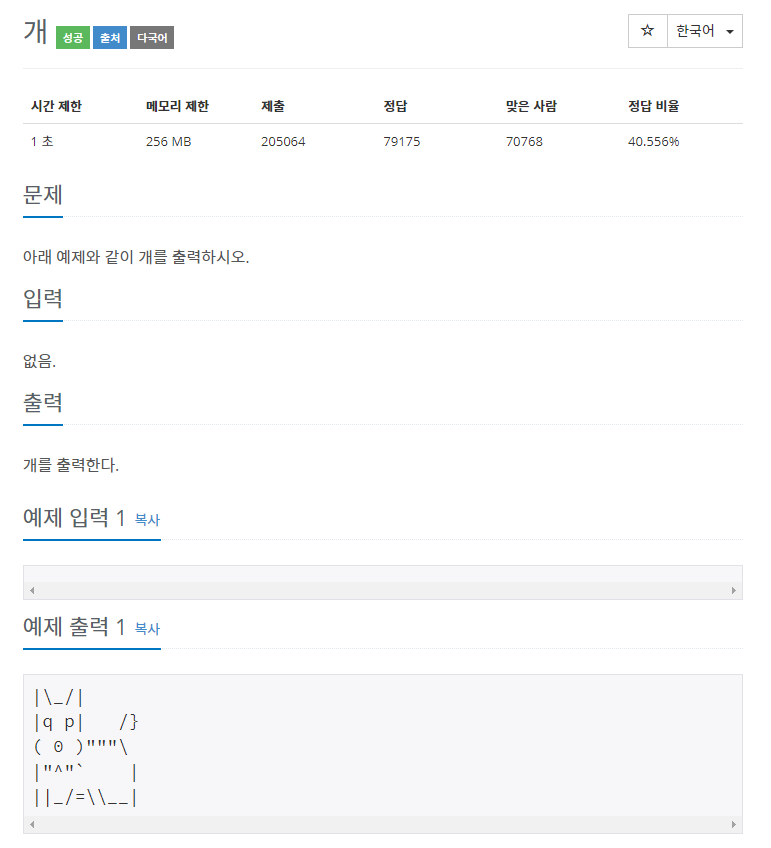

[▶ 10172번 문제 바로가기](https://www.acmicpc.net/problem/10172)  


### 풀이

```python
print("""|\\_/|
|q p|   /}
( 0 )\"\"\"\\
|\"^\"`    |
||_/=\\\\__|""")
```

### 설명

`\(백슬래시)` 를 출력하려면 `\\`와 같이 두개의 백슬래시로 표현해야 하고,  
`"` 를 출력하려면 `\"`와 같이 앞에 백슬래시를 붙여야 합니다.
