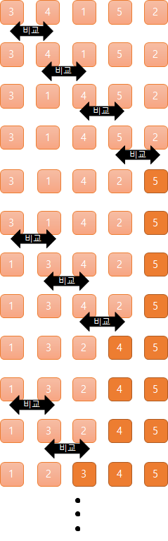
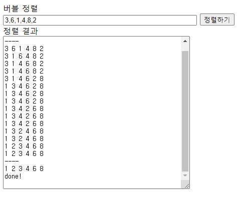

- 버블 정렬(Bubble Sort)이란?
- 버블 정렬 살펴보기
- 버블 정렬 실행해보기 with 자바스크립트

---

## 버블 정렬(Bubble Sort)이란?

서로 인접한 두 원소를 검사해 정렬하는 알고리즘이다.

- 오름차순을 기준으로 정렬한다.
- 큰 숫자가 왼쪽에서 오른쪽을 향해 거품처럼 이동하는 모습

## 버블 정렬 살펴보기

- 이웃한 데이터의 값을 비교해 값의 크기가 다르면 위치를 바꾼다
- 오름차순으로 정렬할 경우 왼쪽 데이터의 크기가 오른쪽 데이터의 크기보다 크면 위치를 바꾼다.



### 계산량 확인해보기

데이터의 총 개수를 n이라고 하면 버블 정렬의 비교 횟수는
처음에 n-1 번, 그 다음은 n-2, n-3 번 ... 이다.

반복 횟수는 (n-1) + (n-2) + (n-3) + ... + 1 이므로 (n²-n)/2이다.  
즉 버블 정렬의 오더는 O(n²)이 된다.

## 버블 정렬 실행해보기 with 자바스크립트

```html
<!-- html -->
<form name="inputForm">
  <div>버블 정렬</div>
  <div>
    <input name="str" size="50" type="text" />
    <input type="button" value="정렬하기" onClick="doSort()" />
  </div>
</form>
<form name="outputForm">
  <div>정렬 결과</div>
  <div><textarea name="result" cols="50" rows="20"></textarea></div>
</form>
```

```javascript
// javascript
function doSort() {
  let inputForm = document.forms.inputForm;
  let outputForm = document.forms.outputForm;
  let ary = inputForm.str.value.split(',');
  ary = ary.map((e) => Number(e));
  outputForm.result.value = ary.join(' ') + '\n';
  outputForm.result.value = outputForm.result.value + '----' + '\n';
  bubbleSort(ary);
  outputForm.result.value = outputForm.result.value + '----' + '\n';
  printAry(ary);
  outputForm.result.value = outputForm.result.value + 'done!' + '\n';

  function bubbleSort(ary) {
    let i = 0;
    while (i < ary.length - 1) {
      let j = 0;
      while (j < ary.length - i - 1) {
        if (ary[j] > ary[j + 1]) {
          let n = ary[j];
          ary[j] = ary[j + 1];
          ary[j + 1] = n;
        }
        j++;
        printAry(ary);
      }
      i++;
    }
  }

  function printAry(ary) {
    outputForm.result.value = outputForm.result.value + ary.join(' ') + '\n';
  }
}
```

### 실행 화면



---

#### Reference

- [모두의 알고리즘 with 자바스크립트](https://www.gilbut.co.kr/book/view?bookcode=BN002328)
