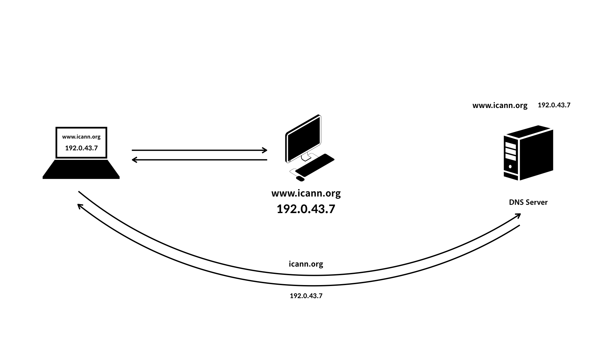

- DNS란?
- DNS의 작동 원리

---

## DNS(Domain Name System)란?

우리는 인터넷을 이용할 때 웹 브라우저의 주소 창에 도메인 이름을 입력한다. 그러면 브라우저는 우리가 원하는 페이지를 띄어준다.

하지만 실제 웹 브라우저와 웹 서버는 숫자로 구성된 IP 주소로 통신한다.

그럼 IP가 아닌 도메인 이름을 입력했는데 어떻게 알아듣고 원하는 페이지를 띄어주는 걸까?

바로 **사용자가 입력한 도메인 주소**를 **IP주소로 변환해주는 시스템인 DNS를 사용**하기 때문이다.

---

## DNS의 작동 원리

웹 브라우저는 입력된 도메인 주소의 서버와 통신 하기 위해 DNS 서버와 메시지를 교환해 해당 서버의 IP주소를 획득하고, 사용자의 요청에 따라 원하는 정보들을 받아온다.

---

#### References

https://opentutorials.org/course/3276/20299
