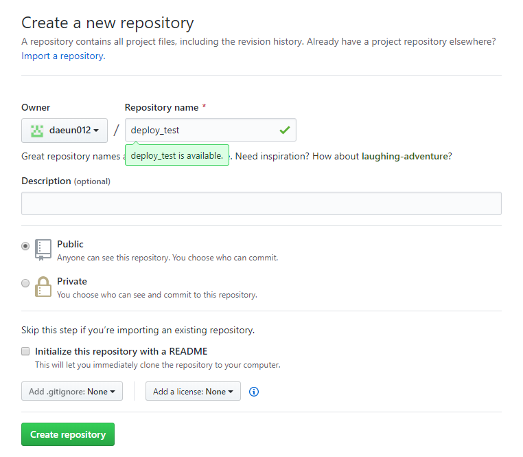

## GitHub Pages

GitHub Pages는 GitHub Repository를 이용해 웹 사이트를 무료로 호스팅해주는 서비스입니다.

- 사용자가 GitHub Repository에 자신의 웹 프로젝트 빌드 결과물을 업로드 하면 GitHub가 그 결과물을 호스팅해 줍니다.

### 1. 로컬 저장소에 Commit 하기

```bash
$ git add .
$ git commit -m " Deploying to Github Pages"
```

지금까지 프로젝트의 파일 및 폴더의 추가/변경 사항을 로컬 저장소에 기록합니다.

### 2. GiHub에 Repository 생성 (원격 저장소 생성)



자신의 GitHub에 새로운 repository를 생성합니다

### 3. 로컬 저장소와 원격 저장소 연결

원격 저장소의 주소를 입력해 로컬 저장소와 원격 저장소를 연결해 줍니다.

```bash
$ git remote add origin https://github.com/daeun012/deploy_test.git
```

로컬 저장소에 기록 한 내용을 원격 저장소에 업로드 합니다.

```bash
$ git push -u origin master
```

### 4. gh-pages 패키지 설치

```bash
$ npm install gh-pages
```

### 5. package.json 수정

package.json 파일에 `"homepage": "https://{GitHub username}.github.io/{Repository name}/" `을 추가해 주고,

```javascript
....
"browserslist": {
"production": [
">0.2%",
"not dead",
"not op_mini all"
],
"development": [
"last 1 chrome version",
"last 1 firefox version",
"last 1 safari version"
]

},
"homepage": "https://daeun012.github.io/deploy_test/" //(*)
}
```

`package.json`의 `"scripts"` 부분에 `"deploy": "gh-pages -d build", "predeploy": "npm run build"`를 추가해 줍니다.

```javascript
...
"scripts": {
"start": "react-scripts start",
"build": "react-scripts build",
"test": "react-scripts test",
"eject": "react-scripts eject",
"deploy": "gh-pages -d build", //(*)
"predeploy": "npm run build" //(*)
},
...
```

- `npm run build` : 현재 프로젝트 코드를 빌드합니다.

- `gh-pages -d build` : build 디렉토리 (-d)에 있는 파일을 GitHub Pages에 업로드 합니다.

### 마지막! GitHub Pages에 빌드 결과물 업로드

```bash
$ npm run deploy
```

hompage에 입력했던 주소로 접속하시면 프로젝트가 배포된 것을 볼 수 있을 겁니다.

---

#### References

https://lktprogrammer.tistory.com/5
