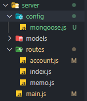

### 1. mongoose 설치

```bash
$ npm install mongoose
```

### 2. MongoDB 연결 파일 생성

현재 폴더 구조입니다.



```javascript
// server/config/mongoose.js
const mongoose = require('mongoose');
module.exports = () => {
  function connect() {
    mongoose.connect('localhost:27017', function (err) {
      if (err) {
        console.error('mongodb connection error', err);
      }
      console.log('mongodb connected');
    });
  }
  connect();
  mongoose.connection.on('disconnected', connect);
};
```

로컬 몽고디비 주소인 localhost:27017을 사용했다.
만약 몽고 디비 아이디와 비밀번혹 있다면,
아이디:비밀번호@localhost:27017을 사용하면 된다.

```javascript
mongoose.connect('아이디:비밀번호@주소:포트/admin', { dbName: '데이터베이스' }, function (err) {});
```

### 3. 서버 실행시 자동으로 MongoDB 연결하기

```javascript
// server/main.js
const express = require('express');
const path = require('path');
const morgan = require('morgan');
const mongoose = require('./confing/mongoose.js'); //(*)
const session = require('express-session');
import api from './routes';

const webpack = require('webpack');
const WebpackDevServer = require('webpack-dev-server');

let app = express();

const port = 3000;
const devPort = 9000;

// mongodb 연결
mongoose();

....
```

---

#### Reference

- https://www.zerocho.com/category/NodeJS/post/57924d1e8241b6f43951af1a
