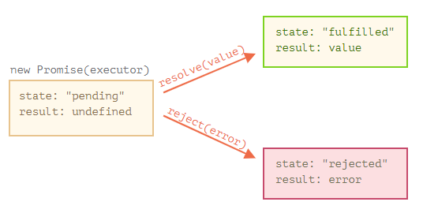

- Promise 기본
- 메서드 : then, catch, finally

---

## Promise 기본

### 1. promise 객체 생성

```javascript
let promise = new Promise(function (resolve, reject) {
  // new Promise에 전달되는 함수 : executor(실행자, 실행함수)
});
```

- `resolve(value)` — 일이 성공적으로 끝난 경우 그 결과를 나타내는 value와 함께 호출
- `reject(error)` — 에러 발생 시 에러 객체를 나타내는 error와 함께 호출
- executor는 resolve나 reject 중 하나를 반드시 호출해야 한다.

### 2. 위의 pormise 객체의 내부 프로퍼티 살펴보기

</img>  
참조 : https://ko.javascript.info/

- state : 처음엔 "pending" / resolve가 호출되면 _"fulfilled"_ / reject가 호출되면 _"rejected"_ 로 변한다.
- result : 처음엔 undefined / resolve(value)가 호출되면 _value_ / reject(error)가 호출되면 _error_ 로 변한다.

---

## 메서드 : then, catch, finally

### 1. then

```javascript
promise.then(
  function (result) {
    /* 프라미스가 이행되었을 때 실행, 실행 결과를 받는다.*/
  },
  function (error) {
    /* 프라미스가 거부되었을 때 실행, 에러를 받는다. */
  }
);
```

ex1 ) 성공적으로 이행된 프라미스

```javascript
let promise = new Promise(function (resolve, reject) {
  setTimeout(() => resolve('done!'), 1000);
});

// resolve 함수는 .then의 첫 번째 함수(인수)를 실행.
promise.then(
  (result) => alert(result), // 1초 후 "done!"을 출력
  (error) => alert(error) // 실행되지 않음
);
```

ex2 ) 에러가 발생한 프라미스

```javascript
let promise = new Promise(function (resolve, reject) {
  setTimeout(() => reject(new Error('에러 발생!')), 1000);
});

// reject 함수는 .then의 두 번째 함수를 실행.
promise.then(
  (result) => alert(result), // 실행되지 않음
  (error) => alert(error) // 1초 후 "Error: 에러 발생!"를 출력
);
```

### 2. catch

- 에러가 발생한 경우만 다루고 싶다면 `.catch(errorHandlingFunction)`를 사용한다.
- `.then(null, errorHandlingFunction)` 과 동일하게 작동한다..

```javascript
let promise = new Promise((resolve, reject) => {
  setTimeout(() => reject(new Error('에러 발생!')), 1000);
});

promise.catch(alert); // 1초 뒤 "Error: 에러 발생!" 출력
```

### 3. finally

- `.finally(f)` 호출은 `.then(f, f)`과 유사하다.

```javascript
new Promise((resolve, reject) => {
  /* 시간이 걸리는 어떤 일을 수행하고, 그 후 resolve, reject를 호출함 */
})
  // 성공·실패 여부와 상관없이 프라미스가 처리되면 실행됨
  .finally(() => 로딩 인디케이터 중지)
  .then(result => result와 err 보여줌 => error 보여줌)
```

---

#### Reference

- https://ko.javascript.info/
