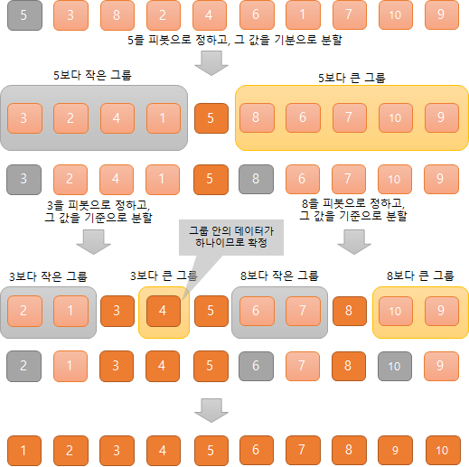
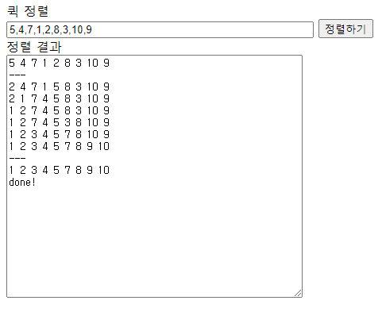

- 퀵 정렬(Quick Sort)이란?
- 퀵 정렬 살펴보기
- 퀵 정렬 실행해보기 with 자바스크립트

---

## 퀵 정렬(Quick Sort)이란?

데이터의 범위를 반으로 나눈 다음, 그 범위를 다시 반으로 나누어 정렬하는 처리를 반복한다.

## 퀵 정렬 살펴보기

- 우선 피봇(기준 값)을 정한다. 피봇으로 정할 데이터는 어떤 데이터든 상관없다.
- 정렬한 데이터의 크기가 피봇보다 큰 그룹과 작은 그룹으로 분할한다.
- 나눈 그룹 안에서도 똑같이 피붓을 정한 후 위와 같은 방식으로 분할한다.
- 이처럼 분할을 반복해 정렬하는 알고리즘을 `분할 정복 알고리즘`이라고 한다



### 계산량 확인해보기

퀵 정렬은 피봇을 기준으로 한 데이터의 크기에 따라 전체 데이터를 균형 있게 절반씩 분할해 나가며,  
그 결과로 log₂n단 만들어진다.  
오더는 O(nlogn)이다.  
하지만 데이터를 나열한 순서가 좋지 않으면 효율이 나빠지고, 최악의 경우에는 오더가 O(n²)이 될 수 있다.

## 퀵 정렬 실행해보기 with 자바스크립트

```html
<!-- html -->
<form name="inputForm">
  <div>퀵 정렬</div>
  <div>
    <input name="str" size="50" type="text" />
    <input type="button" value="정렬하기" onClick="doSort()" />
  </div>
</form>
<form name="outputForm">
  <div>정렬 결과</div>
  <div><textarea name="result" cols="50" rows="20"></textarea></div>
</form>
```

```javascript
// javascript
function doSort() {
  let inputForm = document.forms.inputForm;
  let outputForm = document.forms.outputForm;
  let ary = inputForm.str.value.split(',');
  ary = ary.map(function (e) {
    return Number(e);
  });
  outputForm.result.value = ary.join(' ') + '\n';
  outputForm.result.value = outputForm.result.value + '---' + '\n';
  quickSort(ary);
  outputForm.result.value = outputForm.result.value + '---' + '\n';
  printAry(ary);
  outputForm.result.value = outputForm.result.value + 'done!' + '\n';

  function quickSort(ary) {
    function sort(start, end) {
      if (start >= end) {
        return;
      }
      let left = start;
      let right = end;
      let ref = ary[Math.round((left + right) / 2)];
      while (left < right) {
        if (ary[left] >= ref) {
          while (right > left) {
            if (ary[right] <= ref) {
              let n = ary[left];
              ary[left] = ary[right];
              ary[right] = n;
              right = right - 1;
              break;
            }
            right = right - 1;
          }
          printAry(ary);
        }
        left = left + 1;
      }
      if (ary[right] > ref) {
        sort(start, right - 1);
        sort(right, end);
      } else if (ary[right] < ref) {
        sort(start, right);
        sort(right + 1, end);
      } else {
        sort(start, right - 1);
        sort(right + 1, end);
      }
    }
    sort(0, ary.length - 1);
  }

  function printAry(ary) {
    outputForm.result.value = outputForm.result.value + ary.join(' ') + '\n';
  }
}
```

### 실행 화면



---

#### Reference

- [모두의 알고리즘 with 자바스크립트](https://www.gilbut.co.kr/book/view?bookcode=BN002328)
