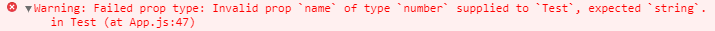

## PropTypes

컴포넌트에 전달된 props를 검사합니다.

### 1. prop-types 라이브러리 설치

`React.PropTypes`는 원래 React 패키지에 내장 되어 있었습니다.  
현재는 다른 패키지로 이동하여 따로 `prop-types` 라이브러리를 설치 해줘야 합니다.

```bash
$ npm install prop-types
```

`pakage.json` 파일로 들어가 다운되었는지 확인합니다.  
dependencies 에 `prop-types`가 있다면 설치가 완료된 것입니다.

```json
.....
"dependencies": {
    "@testing-library/jest-dom": "^4.2.4",
    "@testing-library/react": "^9.5.0",
    "@testing-library/user-event": "^7.2.1",
    "axios": "^0.19.2",
    "gh-pages": "^2.2.0",
    "prop-types": "^15.7.2", //(*)
    "react": "^16.13.1",
    "react-dom": "^16.13.1",
    "react-scripts": "3.4.1"
  },
.....
```

### 2. import 하기

```javascript
import PropTypes from 'prop-types';
```

### 3. 사용하기

```javascript
import React from 'react';
import PropTypes from 'prop-types';

class Test extends React.Component {
  render() {
    return (
      <div>
        <h1>Hello, {this.props.name}</h1>
        <p>age : {this.props.age}</p>
      </div>
    );
  }
}

Test.propTypes = {
  name: PropTypes.string.isRequired, //name은 문자이고, 부모 컴포넌트로부터 반드시 값을 받아야한다.
  age: PropTypes.number, //age는 숫자
};

export default Test;
```

만약 `name props`에 숫자가 전달되거나 아무런 값도 전달 받지 못했다면, 경고문이 JavaScript 콘솔을 통해 보일 것입니다.



### 4. PropTypes 공식 문서

**[PropTypes 공식 문서](https://ko.reactjs.org/docs/typechecking-with-proptypes.html)**에 따라 다양한 Type을 검사하는 방법을 보면 아래와 같습니다.

```javascript
import PropTypes from 'prop-types';

MyComponent.propTypes = {
  // prop가 특정 JS 형식임을 선언할 수 있습니다.
  // 이것들은 기본적으로 모두 선택 사항입니다.
  optionalArray: PropTypes.array,
  optionalBool: PropTypes.bool,
  optionalFunc: PropTypes.func,
  optionalNumber: PropTypes.number,
  optionalObject: PropTypes.object,
  optionalString: PropTypes.string,
  optionalSymbol: PropTypes.symbol,

  // 랜더링 될 수 있는 것들은 다음과 같습니다.
  // 숫자(numbers), 문자(strings), 엘리먼트(elements), 또는 이러한 타입들(types)을
  // 포함하고 있는 배열(array) (혹은 배열의 fragment)
  optionalNode: PropTypes.node,

  // React 엘리먼트.
  optionalElement: PropTypes.element,

  // React 엘리먼트 타입 (ie. MyComponent)
  optionalElementType: PropTypes.elementType,

  // prop가 클래스의 인스턴스임을 선언할 수 있습니다.
  // 이 경우 JS's instanceof 연산자를 사용합니다.
  optionalMessage: PropTypes.instanceOf(Message),

  // 열거형(enum)으로 처리하여 prop가 특정 값들로 제한되도록 할 수 있습니다.
  optionalEnum: PropTypes.oneOf(['News', 'Photos']),

  // 여러 종류중 하나의 종류가 될 수 있는 객체
  optionalUnion: PropTypes.oneOfType([PropTypes.string, PropTypes.number, PropTypes.instanceOf(Message)]),

  // 특정 타입의 행렬
  optionalArrayOf: PropTypes.arrayOf(PropTypes.number),

  // 특정 타입의 프로퍼티 값들을 갖는 객체
  optionalObjectOf: PropTypes.objectOf(PropTypes.number),

  // 특정 형태를 갖는 객체
  optionalObjectWithShape: PropTypes.shape({
    color: PropTypes.string,
    fontSize: PropTypes.number,
  }),

  // An object with warnings on extra properties
  optionalObjectWithStrictShape: PropTypes.exact({
    name: PropTypes.string,
    quantity: PropTypes.number,
  }),

  // 위에 있는 것 모두 `isRequired`와 연결하여 prop가 제공되지 않았을 때
  // 경고가 보이도록 할 수 있습니다.
  requiredFunc: PropTypes.func.isRequired,

  // 모든 데이터 타입이 가능한 값
  requiredAny: PropTypes.any.isRequired,

  // 사용자 정의 유효성 검사기를 지정할 수도 있습니다.
  // 검사 실패 시에는 에러(Error) 객체를 반환해야 합니다.
  // `oneOfType`안에서는 작동하지 않으므로 `console.warn` 혹은 throw 하지 마세요.
  customProp: function (props, propName, componentName) {
    if (!/matchme/.test(props[propName])) {
      return new Error('Invalid prop `' + propName + '` supplied to' + ' `' + componentName + '`. Validation failed.');
    }
  },

  // `arrayOf` 와 `objectOf 에 사용자 정의 유효성 검사기를 적용할 수 있습니다.
  // 검사 실패 시에는 에러(Error) 객체를 반환해야 합니다.
  // 유효성 검사기는 배열(array) 혹은 객체의 각 키(key)에 대하여 호출될 것입니다.
  // 유효성 검사기의 첫 두 개의 변수는 배열 혹은 객체 자신과 현재 아이템의 키입니다.

  customArrayProp: PropTypes.arrayOf(function (propValue, key, componentName, location, propFullName) {
    if (!/matchme/.test(propValue[key])) {
      return new Error(
        'Invalid prop `' + propFullName + '` supplied to' + ' `' + componentName + '`. Validation failed.'
      );
    }
  }),
};
```

---

#### Reference

- https://velopert.com/1130
- https://ko.reactjs.org/
