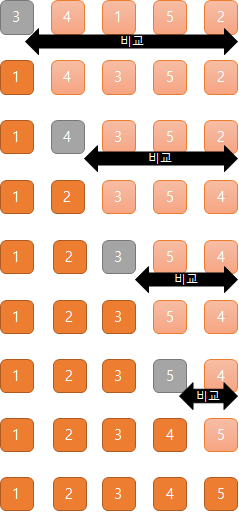
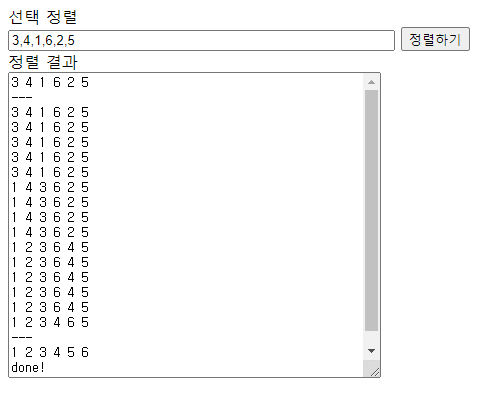

- 선택 정렬(Selection Sort)이란?
- 선택 정렬 살펴보기
- 선택 정렬 실행해보기 with 자바스크립트

---

## 선택 정렬(Selection Sort)이란?

값이 가장 작은 숫자를 찾아 가장 왼쪽에 있는 데이터부터 순서대로 데이터를 교환하여 정렬하는 처리를 반복한다.

## 선택 정렬 살펴보기

- 우선 정렬하고자 하는 데이터 안에서 값을 하나 골라 임시 최솟값으로 정한다.
- 데이터 전부를 임시 최솟값과 비교한다.
- 임시 최솟값보다 값이 작은 데이터가 있다면, 값이 가장 작은 데이터의 위치와 임시 최솟값의 위치를 바꾼다.



### 계산량 확인해보기

데이터의 총 개수를 n이라고 하면 선택 정렬의 비교 횟수는
처음에 n-1 번, 그 다음은 n-2, n-3 번 ... 이다.

반복 횟수는 (n-1) + (n-2) + (n-3) + ... + 1 이므로 (n²-n)/2이다.  
즉 선택 정렬의 오더는 O(n²)이 된다.

오더가 버블 정렬과 같지만,  
버블 정렬은 데이터의 위치를 바꾸는 횟수가 선택 정렬보다 많기 때문에 선택 정렬이 더 빨리 끝난다. 메모리에 저장된 데이터를 비교하는 처리보다 위치를 바꾸는 처리가 시간이 많이 걸리기 때문이다.

## 선택 정렬 실행해보기 with 자바스크립트

```html
<!-- html -->
<form name="inputForm">
  <div>선택 정렬</div>
  <div>
    <input name="str" size="50" type="text" />
    <input type="button" value="정렬하기" onClick="doSort()" />
  </div>
</form>
<form name="outputForm">
  <div>정렬 결과</div>
  <div><textarea name="result" cols="50" rows="20"></textarea></div>
</form>
```

```javascript
// javascript
function doSort() {
  let inputForm = document.forms.inputForm;
  let outputFrom = document.forms.outputForm;
  let ary = inputForm.str.value.split(',');
  ary = ary.map(function (e) {
    return Number(e);
  });
  outputForm.result.value = ary.join(' ') + '\n';
  outputForm.result.value = outputForm.result.value + '---' + '\n';
  selectionSort(ary);
  outputForm.result.value = outputForm.result.value + '---' + '\n';
  printAry(ary);
  outputForm.result.value = outputForm.result.value + 'done!' + '\n';

  function selectionSort(ary) {
    let i = 0;
    let min;
    while (i < ary.length) {
      min = i;
      let j = i + 1;
      while (j < ary.length) {
        if (ary[min] > ary[j]) {
          min = j;
        }
        j = j + 1;
        printAry(ary);
      }
      let n = ary[i];
      ary[i] = ary[min];
      ary[min] = n;
      i = i + 1;
    }
  }

  function printAry(ary) {
    outputForm.result.value = outputForm.result.value + ary.join(' ') + '\n';
  }
}
```

### 실행 화면



---

#### Reference

- [모두의 알고리즘 with 자바스크립트](https://www.gilbut.co.kr/book/view?bookcode=BN002328)
