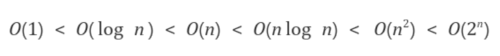

- 시간 복잡성이란?
- O 표기법

---

## 시간 복잡성이란?

계산의 복잡성,
계산이 복잡해지는 만큼 처리하는 스텝의 개수가 늘어나므로 `실행 시간이 오래 걸린다`는 뜻이다.

- 스텝 : CPU가 실행하는 명령

---

## O 표기법

알고리즘의 `계산량이 얼마나` 될지 대략적으로 표현한 지표.  
구체적인 실행 시간이나 명령의 개수는 알려주지 않는다.

같은 프로그램을 실행해도 `컴퓨터의 처리 성능`에 따라 `실행 시간이 달라`지기 때문에,
입력된 데이터 n의 크기에 따라 시간 계산량이 `어느 정도의 비율로 늘어나는지`를 O(n 식)의 형태로 표현하는 것이다.

O(n) : 입력한 데이터의 크기(개수나 자릿수 등)을 n이라고 했을 때 알고리즘을 최대 n번 실행하면 처리가 완료된다는 뜻이다.(반드시 n번만에 완료된다는 것이 아니라 알고리즘의 최대 실행 횟수가 n번이라는 뜻이다.)

### 1. O 표기법의 식

차수가 가장 큰 항만 남기고 계수는 1로 한다.

```
O(3) → O(1)
O(n-1) → O(n)
O(4n²+3n) → O(n²)
O(n³+7n²+12) → O(n³)
O(2n³+3m²) → O(n³+m²)
```

### 2. 괄호 안에 자주 사용되는 식과 계산량의 대소 관계



### 3. 오더 수와 시간 계산량

시간 계산량의 오더에서  
O(n), O(n²), O(n³)과 같은 오더를 가르켜 `다항 시간 알고리즘`이라 부르며  
O(n!), O(2ⁿ)과 같은 오더는 `지수 시간 알고리즘`이라 부른다.

다항 시간 알고리즘으로는 어느 정도 실용적인 프로그램을 만들어 낼 수 있다.  
하지만 지수 시간 알고리즘은 n값이 증가함에 따라 계산량도 급격히 늘어나기 때문에 현실적인 시간 내에 문제를 해결하지 못할 우려가 있다.

---

#### Reference

- [모두의 알고리즘 with 자바스크립트](https://www.gilbut.co.kr/book/view?bookcode=BN002328)
